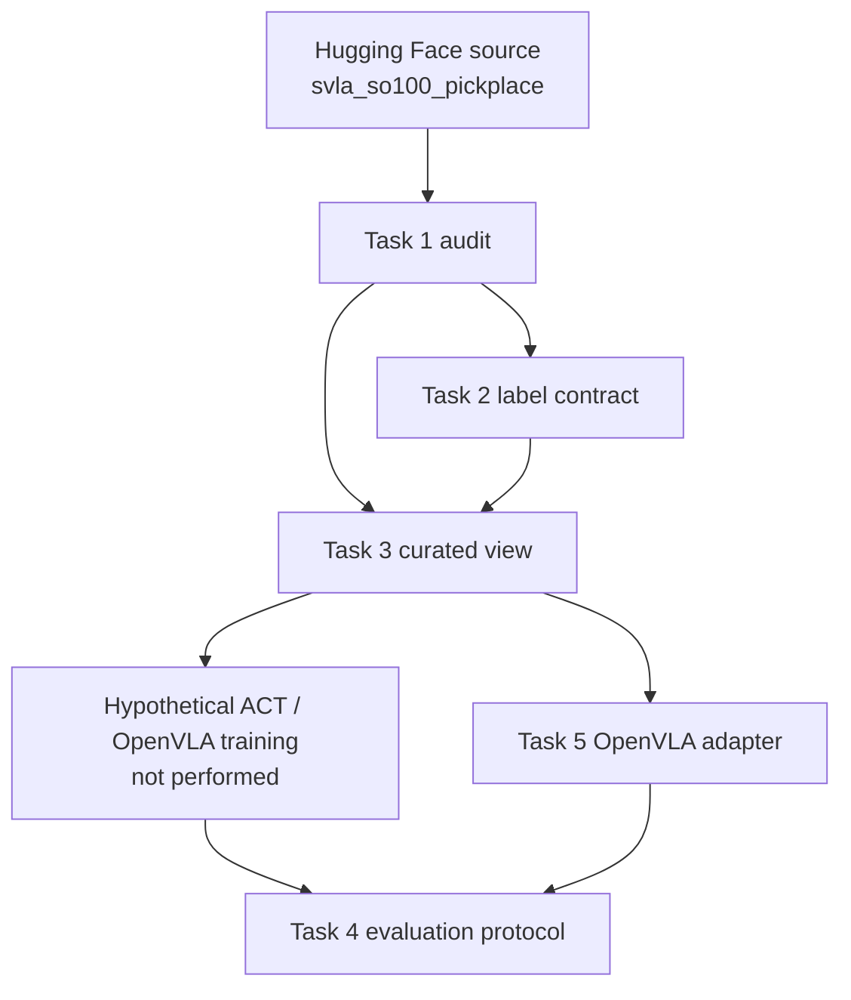

# OpenArm — Teleoperation & Wrist-Camera Data Pipeline

A reproducible teleoperation and wrist-camera data pipeline covering audit, labeling design, curation, policy evaluation, and OpenVLA adaptation for the DeepAware AI / Robotics Center of Silicon Valley take-home.

## Assignment coverage

| Task | Teleoperation | Egocentric | Main artifact | Qualification |
|------|---------------|------------|---------------|---------------|
| 1 Quality audit | Done | Done | [`tasks/task_01_quality_audit/findings.md`](tasks/task_01_quality_audit/findings.md) | Full audit run on real data |
| 2 Labeling design | Done | Done | [`tasks/task_02_labeling_design/README.md`](tasks/task_02_labeling_design/README.md) | Design/schema only; no real GT campaign |
| 3 Curation | Done | Done | [`tasks/task_03_curation_pipeline/design_and_results.md`](tasks/task_03_curation_pipeline/design_and_results.md) | Manifest-backed view over immutable source |
| 4 Policy evaluation | Done | Done | [`tasks/task_04_policy_evaluation/README.md`](tasks/task_04_policy_evaluation/README.md) | Protocol designed, not executed; detector is a failed terminal proxy |
| 5 OpenVLA adaptation | Done | Done | [`tasks/task_05_vla_adaptation/README.md`](tasks/task_05_vla_adaptation/README.md) | Adapter/config/smoke test; no 7B download or training |

## Key results

| Result | Value |
|--------|-------|
| Primary dataset | `lerobot/svla_so100_pickplace` @ `728583b5eaf9e739a7f119e2def466fa1d552402` |
| Episodes / frames | 50 / 19,631 |
| Cameras | wrist = verified egocentric; top = verified external |
| Structural video/timing defects | None detected by implemented checks |
| Within-episode adjacent pairs | 19,581 |
| Exact / near-lossless / near duplicates | 3,227 (16.48%) / 991 (5.06%) / 7,405 (37.82%) |
| Overexposed wrist frames | 267 (1.36%) |
| Task 3 horizon-16 windows | conservative 18,881; strict 18,386 |
| Task 5 single-timestep examples | conservative 19,631; strict 19,391 |
| Tests | 88 passing (`pytest -q`) |
| Task 4 planned rollouts | 100 (none executed) |
| Wrist proxy temporal false-early-trigger | 1.00 (not a usable success detector) |
| OpenVLA smoke test | Passed on real wrist frames; no checkpoint downloaded |

## System architecture



Policy/VLA training boxes are design targets only. This repository does not claim trained checkpoints or executed rollouts.

## Repository structure

```text
src/openarm_pipeline/     # audit, curation, labeling helpers, eval, VLA adapter
scripts/                  # CLI entrypoints
configs/                  # audit, curation, evaluation, OpenVLA LoRA YAML
tasks/                    # per-task write-ups and schemas
artifacts/                # committed small JSON/PNG summaries
tests/                    # unit + integration tests
docs/                     # assumptions, progress, submission checklist
data/                     # gitignored curated/export/model caches
```

## Dataset choice

The original `aloha_sim_insertion_human` corpus is a useful **teleoperation-only** baseline, but it does not provide a verified wrist/egocentric camera paired with the same state/action stream needed for this assignment’s egocentric track.

`lerobot/svla_so100_pickplace` was selected as the primary paired dataset because it supplies synchronized six-dimensional state/action, wrist and top cameras, timestamps, and episode/frame indices on a pinned revision suitable for Tasks 1–5.

The ALOHA audit artifacts remain under `artifacts/task_01_quality_audit/aloha_sim_insertion_human/` as a teleoperation-only comparison baseline.

## Task 1 — Quality audit

- Teleoperation: 50 episodes, 19,631 frames, six joint dimensions including gripper.
- Wrist-camera issues: high adjacent-duplicate rates, overexposure (1.36%), absolute blur threshold 50 miscalibrated (diagnostic only).
- Alignment: shared episode/`frame_index` coupling; no missing videos or structural timing mismatches detected.
- Hard defects vs soft flags: hard structural failures none; visual duplicates/exposure/blur treated as soft/diagnostic unless elevated by curation policy.
- Details: [`tasks/task_01_quality_audit/findings.md`](tasks/task_01_quality_audit/findings.md)

## Task 2 — Labeling design

- Three annotation levels: episode, segment, and frame/event labels (plus interaction, visibility, failure, attention-proxy ROI).
- Egocentric-specific labels: wrist visibility, self-occlusion, target-in-view, attention-proxy ROI (not measured gaze).
- Temporal alignment: immutable identity `(revision, episode, frame, timestamp)`; segments are half-open.
- Agreement protocol documented; validator and tests pass.
- Sample annotation is **synthetic**; no real ground-truth labels were created.
- Details: [`tasks/task_02_labeling_design/README.md`](tasks/task_02_labeling_design/README.md)

## Task 3 — Curation

- Hard validation: 50 episodes accepted; 19,631 hard-valid timesteps; zero hard-invalid timesteps.
- Gripper-safe Savitzky–Golay smoothing on arm joints only.
- Visual quality flags aligned to the same timestep identity.
- Conservative / strict horizon-16 windows: 18,881 / 18,386.
- Output is a **manifest-backed view** over immutable source media (not independently deleted video frames).
- Synthetic corruptions prove filters activate.
- Details: [`tasks/task_03_curation_pipeline/design_and_results.md`](tasks/task_03_curation_pipeline/design_and_results.md)

## Task 4 — Policy evaluation

- ACT evaluation assumptions and a validated **100-rollout** simulation matrix.
- Metrics and a staged sim-to-real ladder are designed; **no ACT/Diffusion Policy was trained** and **no rollouts were executed**.
- Offline wrist terminal-completion proxy: frame AUROC 0.833, frame F1 0.756, temporal false-early-trigger rate **1.00**.
- The detector is an important negative finding: it must **not** supply primary task success.
- Primary success must come from simulator state, trusted external evaluation, or adjudicated labels.
- Details: [`tasks/task_04_policy_evaluation/README.md`](tasks/task_04_policy_evaluation/README.md)

## Task 5 — OpenVLA adaptation

Verified OpenVLA (repo `openvla/openvla` @ `c8f03f48af69`, model `openvla/openvla-7b` @ `47a0ec7fc4ec…`, MIT + Llama Community License): single image + language → 7-DoF discretized actions, causal LM loss, LoRA-capable.

**Count units:** Task 3’s 18,881 / 18,386 are horizon-16 windows. Task 5’s 19,631 / 19,391 are single-timestep OpenVLA examples because stock OpenVLA predicts single-step actions. Different units; not contradictory.

**Action space:** SO-100 6-D joints → train-only q01/q99 → [-1, 1] → 7th dim zero-padded with adapter `action_mask=0`. Adapter-side masking is tested; stock fine-tune loss must be modified to honor the mask (or use a native 6-D head). Not fully stock-compatible without that change.

**Preprocessing boundary:** decode BGR → RGB → resize 224 → emit NHWC uint8 processor input. Official PrismaticProcessor / CHW normalized tensors are **not** produced by the smoke test.

**Baseline:** wrist-only, conservative curation, LoRA starting config in `configs/openvla_lora.yaml` (proposed, not trained). No checkpoint downloaded; no fine-tuning; no VLA rollout.

Details: [`tasks/task_05_vla_adaptation/README.md`](tasks/task_05_vla_adaptation/README.md)

## Teleoperation versus egocentric trade-offs

| Dimension | Teleoperation | Egocentric (wrist) |
|-----------|---------------|--------------------|
| Data type | Joint state/action streams | Wrist RGB + coupled joints |
| Typical corruption | Spike/freeze, gripper multimodality | Blur, exposure, duplicates, self-occlusion |
| Filtering confidence | Higher for tabular hard checks | Lower for visual soft flags |
| Alignment risk | Episode/frame coupling | Same, plus camera latency/rolling shutter |
| Label granularity | Segment + event | Plus visibility / attention-proxy ROI |
| Evaluation signal | Sim state / external success | Weak offline visual proxies |
| Model adaptation risk | Action-space mismatch | Third-person→ego viewpoint shift |

## Reproduction

```bash
uv venv .venv && source .venv/bin/activate
uv pip install -e ".[dev]"
python -m pytest tests/ -q
```

Commands that may require dataset download/cache access are marked.

```bash
# Task 1 audit (requires dataset cache/download)
python scripts/audit_dataset.py \
  --repo-id lerobot/svla_so100_pickplace \
  --output-dir artifacts/task_01_quality_audit/svla_so100_pickplace

# Task 2 annotation validation (synthetic sample; offline)
python scripts/validate_annotations.py --require-exhaustive

# Task 3 curation (requires dataset cache/download)
python scripts/curate_dataset.py \
  --repo-id lerobot/svla_so100_pickplace \
  --revision 728583b5eaf9e739a7f119e2def466fa1d552402 \
  --config configs/curation.yaml \
  --output-root data/curated/svla_so100_pickplace \
  --artifacts-dir artifacts/task_03_curation_pipeline \
  --force

# Task 4 protocol + offline proxy (protocol offline; detector needs wrist cache)
python scripts/validate_rollout_protocol.py
python scripts/evaluate_success_detector.py

# Task 5 OpenVLA adapter (needs curated view + wrist video cache; no model download)
python scripts/export_openvla_dataset.py
python scripts/validate_openvla_dataset.py
python scripts/smoke_test_openvla_batch.py
```

Submission checklist: [`docs/submission_checklist.md`](docs/submission_checklist.md)

## Simplifying assumptions

- No hardware access; public datasets and simulation design only.
- No joint-limit ground truth; statistical outliers ≠ physical invalidity.
- No real annotation campaign; schemas and synthetic sample only.
- No trained ACT/Diffusion/OpenVLA policy.
- No genuine task-success labels; wrist detector is a failed temporal proxy.
- Heuristic visual thresholds are dataset-dependent (blur@50 diagnostic only).
- Source media remains immutable; curation is a manifest-backed view.

## Limitations

- Single task and embodiment (SO-100 pick-and-place).
- Limited camera diversity (one wrist, one top).
- No true failure demonstrations or hardware calibration.
- No policy rollout results.
- Completion proxy fails temporally (false-early-trigger 1.00).
- OpenVLA embodiment/action-space mismatch requires project-specific masking or a native 6-D head.
- Manifest-backed curated/export views still require source dataset access.

## Next steps with more time or hardware

1. Collect OpenArm wrist/top/state/action data.
2. Calibrate camera and joint limits.
3. Label real successes, partial successes, and failures.
4. Validate curation thresholds on that corpus.
5. Train an ACT baseline.
6. Fine-tune OpenVLA with native action masking/head.
7. Run the Task 4 simulation protocol.
8. Run staged hardware evaluation.
9. Train a genuine success detector.
10. Add multi-view fusion beyond stock single-image OpenVLA.

## Honesty statement

**Implemented and run:** Task 1 audit, Task 2 schemas/validator, Task 3 curation pipeline, Task 4 rollout-protocol validation and offline wrist proxy prototype, Task 5 OpenVLA adapter/export/smoke test on real wrist frames, and the automated test suite.

**Designed only:** ACT/Diffusion evaluation execution, OpenVLA LoRA training schedule, multi-view fusion, hardware ladder.

**Not performed:** real GT labeling, ACT/Diffusion training, policy rollouts, OpenVLA-7B download/fine-tuning, hardware evaluation, or fabricated success rates.
